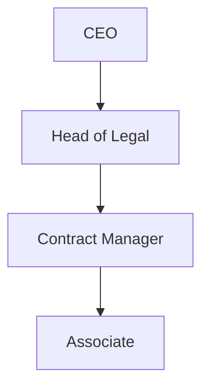

# 📌 Phase 2: Org Setup & Configuration – Completed ✅

This document records all the setup and configuration steps performed in Salesforce for the **RenewSure – Smart Contract Expiry & Renewal Tracker** project.  
Phase 2 focused on preparing the Salesforce org environment and ensuring proper security, access, and configuration settings.

---

## 🔹 1. Salesforce Edition & Org Setup
- Selected **Salesforce Developer Edition Org** for initial implementation.
- Connected Org with **VS Code (SFDX Project Setup)**.
- Verified basic org information:  
  - Company Profile  
  - Default Locale: **English (India)**  
  - Default Currency: **INR (₹)**  

## 🔹 2. Company Profile Setup
- Updated **Company Information** (Company Name = *RenewSure*).  
- Set **Fiscal Year = Standard (Jan–Dec)**.  
- Configured **Business Hours**:  
  - Default = **Mon–Fri, 09:00–18:00 IST**  
  - Holidays = Added placeholder holiday list.  

## 🔹 3. User Setup & Licenses
- Created initial project users with **Standard Salesforce Licenses**:  
  - CEO (System Administrator)  
  - Head of Legal  
  - Contract Manager  
  - Associate  

## 🔹 4. Role Hierarchy
Configured **Role Hierarchy** for visibility:  

- **CEO** → Full visibility  
- **Head of Legal** → Access to all Contract Managers’ records  
- **Contract Manager** → Access to Associates’ records  
- **Associates** → Access only to their own records  

## 🔹 5. Organization-Wide Defaults (OWD)
- `Contract__c` object → **Private**  
- `Grant Access Using Hierarchies` → ✅ Enabled  

## 🔹 6. Login & Security Policies
### 6.1 Trusted IP Ranges (Network Access)
| Name             | Start IP     | End IP       | Description                     |
|------------------|-------------|-------------|---------------------------------|
| Office HQ – India | 47.11.15.0  | 47.11.15.255 | Primary Office IP Range         |
| Admin Home       | 47.11.15.0  | 47.11.15.255 | Temporary Admin IP (example)    |

### 6.2 Session Settings
- **Session Timeout:** 30 minutes  
- **Lock sessions to originating IP:** ❌ Disabled (kept flexible)  

### 6.3 Login Hours (Profiles)
| Profile            | Mon–Fri       | Sat         | Sun         |
|--------------------|--------------|------------|------------|
| Contract Manager   | 09:00–18:00  | No access  | No access  |
| Legal Team         | 09:00–18:00  | 10:00–14:00 | No access |

## 🔹 7. Deliverables Produced
- ✅ Role Hierarchy Diagram  
- ✅ Access Rules Documentation  
- ✅ Login & Security Policy Document  
- ✅ Org Setup Verification  

## 📌 Phase 2 Status: **Completed Successfully ✅**

Next Step → **Phase 3: Data Modeling & Object Configuration** (Custom Objects, Fields, Relationships).
